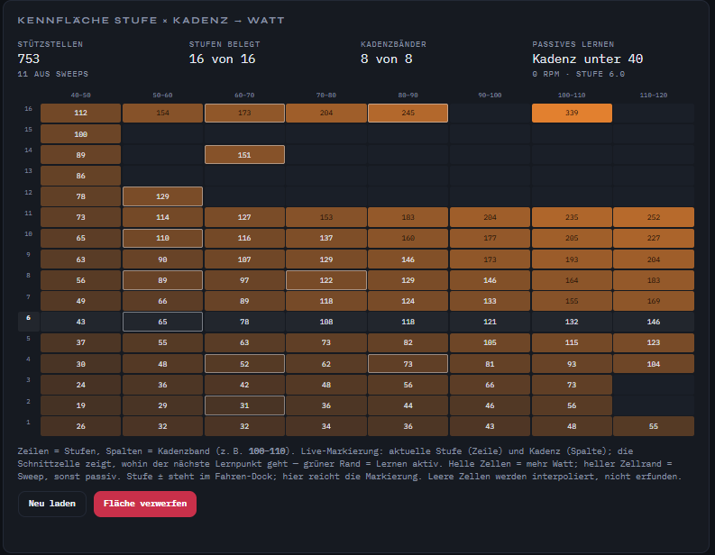

# Kennfläche — Snapshot 2026-09-15 (Heatmap)

Stand nach weiterem passivem Lernen. Alle acht Kadenzbänder haben mindestens
eine Zelle; die Mitte (Stufe 4–11) ist voll. Screenshot:
[`screenshots/kennflaeche.png`](screenshots/kennflaeche.png).

## UI (ab 0.3.23)

Die Heatmap markiert live die **aktuelle Stufe als Zeile** und das **Kadenzband
als Spalte**. Die Schnittzelle ist die Zielzelle fürs nächste Lernen
(grüner Rand = `calib.passive.accept`). Stufe ± bleibt im Fahren-Dock — unter
der Matrix keine eigenen Buttons. Die Tabelle selbst ist Diagnose/Füllhilfe;
das Datenmodell läuft unabhängig davon im Hintergrund (ERG/HR/Reha).

Watt-Raster (abgeschrieben aus der Live-Heatmap, kein `/api/calib/get`-Dump):
[`kalibrierung-map-20260915.json`](kalibrierung-map-20260915.json).
Letzter API-Dump mit Sample-Zählern `n`/`s`/`t`:
[`kalibrierung-map-20260913.json`](kalibrierung-map-20260913.json).

Gerät: TC174 `c2:32:a5:1e:bf:b5`, Slot 0.
**753 Stützstellen** (11 aus Sweeps), **99 von 128 Zellen** belegt,
**16 von 16** Stufen, **8 von 8** Kadenzbändern.
`*` = Sweep-Stützstelle. DeviceStore-Decke in der Entwickler-UI weiter
**224 W**; heißeste Rasterzelle **339 W** @ Stufe 16 / 100–110 rpm.

## Raster Watt (passiv + Sweep)

| Stufe | 40–50 | 50–60 | 60–70 | 70–80 | 80–90 | 90–100 | 100–110 | 110–120 |
|------:|------:|------:|------:|------:|------:|-------:|--------:|--------:|
| 1 | 26 | 32 | 32 | 34 | 36 | 43 | 48 | 55 |
| 2 | 19 | 29 | 31* | 36 | 44 | 46 | 56 | — |
| 3 | 24 | 36 | 42 | 48 | 56 | 66 | 73 | 104 |
| 4 | 30 | 48 | 52* | 62 | 73* | 81 | 93 | 104 |
| 5 | 37 | 55 | 63 | 73 | 82 | 105 | 115 | 123 |
| 6 | 43 | 65* | 78 | 108 | 118 | 121 | 132 | 146 |
| 7 | 49 | 66 | 89 | 118 | 124 | 133 | 155 | 169 |
| 8 | 56 | 89* | 97 | 122* | 129 | 146 | 164 | 183 |
| 9 | 63 | 90 | 107 | 129 | 146 | 173 | 193 | 204 |
| 10 | 65 | 110* | 116 | 137 | 160 | 177 | 205 | 227 |
| 11 | 73 | 114 | 127 | 153 | 183 | 204 | 235 | 252 |
| 12 | 78 | 129* | — | — | — | — | — | — |
| 13 | 86 | — | — | — | — | — | — | — |
| 14 | 89 | — | 151* | — | — | — | — | — |
| 15 | 100 | — | — | — | — | — | — | — |
| 16 | 112 | 154 | 173* | 204 | 245* | — | 339 | — |

## Was sich seit 2026-09-13 geändert hat

Damals: 62 Zellen, 7/8 Bänder, Band 110–120 leer, ~480 Samples.
Jetzt: **99 Zellen**, **8/8 Bänder**, **753 Samples**.

- Stufe **4–11** ist über alle acht Bänder gefüllt — das ist der Bereich, in
  dem ERG/Workouts typischerweise interpolieren.
- Band **110–120** ist für Stufe 1 und 3–11 da (Stufe 2 noch leer).
- Band **100–110** reicht jetzt bis Stufe 11 durchgehend, plus die 339-W-Zelle
  auf Stufe 16.
- Oben rechts (Stufe 12–16 × hohe Kadenz) bleibt dünn — erwartbar, das ist
  schwer zu halten. Die Sweep-Stützen bei 60 und 80 rpm auf 12/14/16 stehen.
- Monotonie Stufe↑ / Kadenz↑ hält in der dichten Mitte. Bekannte Ausnahme:
  Stufe 1 @ 40–50 (26 W) liegt über Stufe 2 (19 W) — schon im alten Snapshot.
  Stufe 3 @ 110–120 = 104 W sitzt auf derselben Zahl wie Stufe 4; das kann ein
  kurzer Spike sein, kein zweiter Sweep.

## Hinweise zum Füllen

- Spalte **100–110** füllt nur bei rpm ≥ 100 (98 landet in 90–100).
- Passiv: Stufe ≥ 20 s halten, dann alle 5 s ein Punkt.
- Lücken, die sich noch lohnen: Stufe 12–16 in den hohen Bändern;
  Stufe 2 @ 110–120; Stufe 16 @ 90–100 und 110–120.
- Frühere Sweep-Protokolle: [../debug/HW_TEST1_60RPM.md](../../debug/HW_TEST1_60RPM.md),
  [HW_TEST2_80RPM.md](../../debug/HW_TEST2_80RPM.md).
